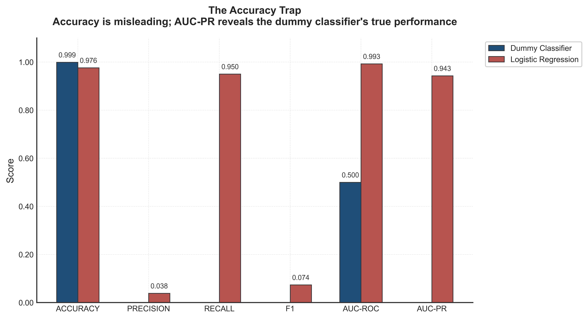
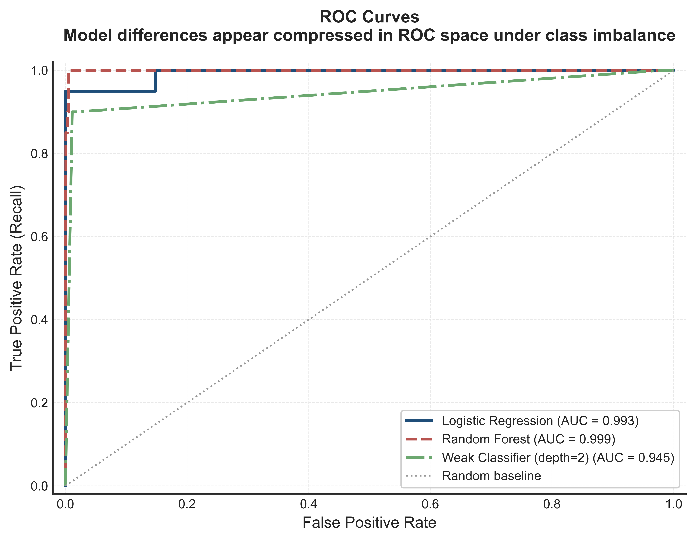
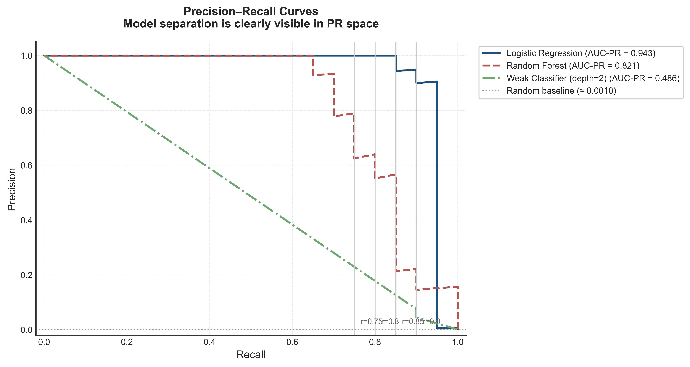
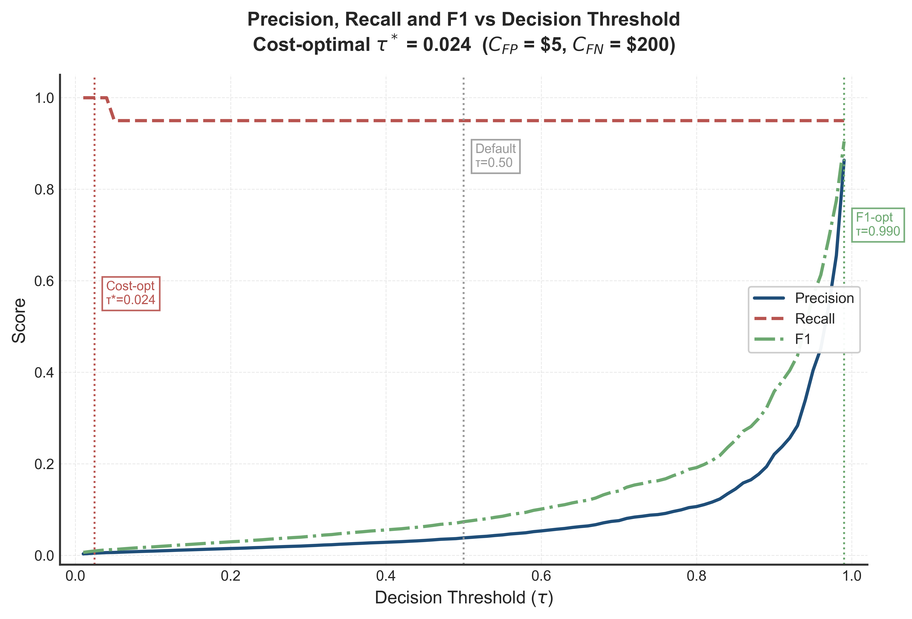
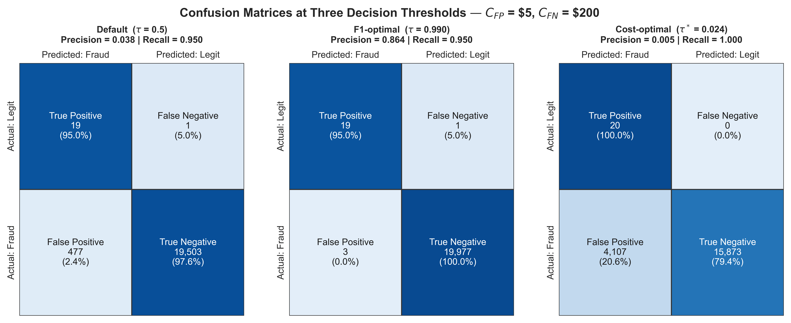
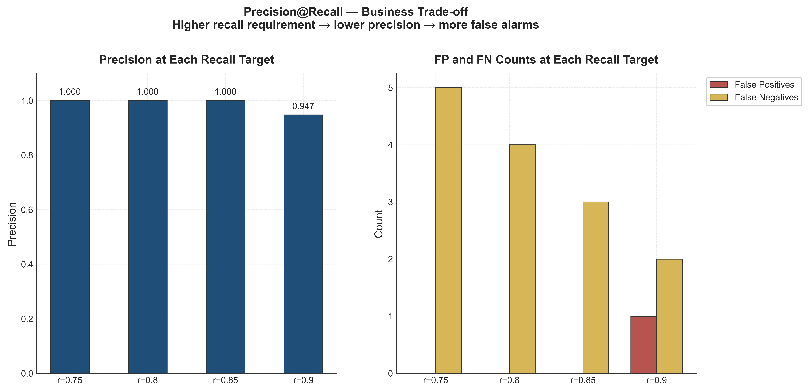
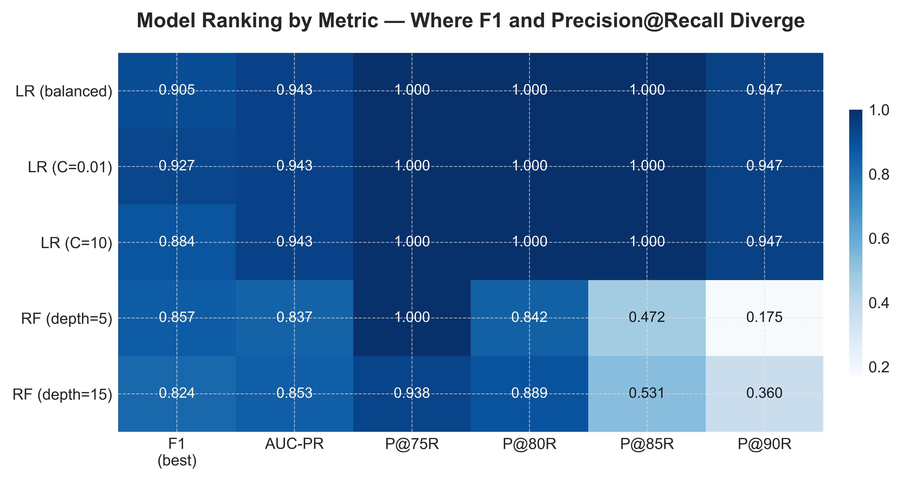

# Not All Errors Cost the Same

**Bayesian Foundations of Evaluation Metrics for Fraud Detection: from F1 to Precision@Recall**

*Bruno Ramos Martins — 2026*

---

## Abstract

Fraud detection is an imbalanced classification problem in which two types of errors carry fundamentally different consequences: missing a fraud costs far more than blocking a legitimate transaction. Despite this asymmetry, F1 score — which treats both error types as equally costly — remains the default evaluation metric in most practitioner workflows. This article argues that F1 is not wrong, but that its assumptions are rarely made explicit; and that when those assumptions are violated, it produces misleading model rankings. Starting from a probabilistic reading of the confusion matrix, we derive precision and recall as conditional probabilities and connect them to Bayes' theorem. We show that class imbalance is not a data problem but a base rate problem, and that the optimal decision threshold follows directly from the ratio of error costs. We then map the full metric landscape — ROC curves, Precision-Recall curves, and Precision@Recall — showing that each metric encodes a different assumption about the operating context. A suite of reproducible experiments on both synthetic and real fraud data confirms that metric choice changes model rankings, that the default threshold of 0.5 is rarely optimal, and that Precision@Recall is the most operationally honest metric when a business recall target is defined. The article closes with a decision framework: a set of practical questions whose answers lead unambiguously to the right metric for a given deployment context.

---

## 1. Introduction

A few months ago I was reviewing the evaluation setup for a fraud detection model. The model had been trained, cross-validated, and ranked using F1. The F1 score was competitive. The model was deployed.

Later, in a different conversation — the kind of technical discussion that begins casually and ends with you staring at a whiteboard — someone asked: *"Why F1? What are you actually assuming when you use it?"*

I had no rigorous answer. F1 was the metric on the checklist. It combined precision and recall into a single number. It worked.

That conversation led to this article.

The question is not whether F1 is a bad metric. It is whether F1 is an *honest* metric in a specific context: binary classification under severe class imbalance where the two types of errors carry asymmetric costs. In fraud detection, a false negative — approving a fraudulent transaction — typically costs an order of magnitude more than a false positive — blocking a legitimate one. F1 weights these two error types equally by construction. That implicit assumption is almost never stated and almost never true.

This article makes that assumption explicit, derives what the right metric *should* look like under asymmetric costs, and shows empirically that the choice of metric changes model rankings and deployment decisions in ways that matter.

### What drives this article

Every evaluation metric is a compressed answer to the question: *"What should the model optimise for?"* Different metrics encode different answers. Accuracy encodes: *"Every correct prediction counts equally."* F1 encodes: *"Precision and Recall matter equally, and I care more about the minority class than accuracy alone."* Precision@Recall encodes: *"I have a non-negotiable recall requirement, and I want the highest precision achievable within it."*

The central thesis is this: in fraud detection, the last formulation is the honest one. The mathematical derivation that justifies it connects to Bayes' theorem, cost-sensitive decision theory, and the geometry of Precision-Recall curves. All of that machinery is here, built bottom-up.

### Who this article is for

A data scientist or machine learning engineer who uses precision, recall, F1, and AUC-ROC in daily work, and who wants to understand not just *how* these metrics are computed but *what* they measure and *when* each one is appropriate. No prior knowledge of Bayesian inference is assumed. The necessary conditional probability is developed from scratch.

### Roadmap

The article is structured as follows. Sections 2–4 build the probabilistic foundation: the confusion matrix as conditional probability, the role of the base rate through Bayes' theorem, and cost-sensitive decision theory with its optimal threshold. Sections 5–8 map the metric landscape: F1, the ROC curve, the Precision-Recall curve, and Precision@Recall. Section 9 presents five experiments that provide empirical evidence for every claim made in the theory sections. Section 10 synthesises the metric selection framework. Section 11 closes with practical takeaways.

---

## 2. The Confusion Matrix — A Probabilistic Reading

Most practitioners encounter the confusion matrix early in their training, usually presented as a 2×2 table of counts. This section reframes it as a table of *conditional probabilities*. The reframing is small but changes everything.

### 2.1 The four cells as events

Let \(Y \in \left\{0, 1\right\}\) be the true label — 1 for fraud, 0 for legitimate — and \(\hat{Y} \in \left\{0, 1\right\}\) the model's prediction. The four cells of the confusion matrix correspond to the four intersections of the event space \(\left\{Y = 0, Y = 1\right\} \times \left\{\hat{Y} = 0, \hat{Y} = 1\right\}\):

| | Predicted: Fraud ($\hat{Y}=1$) | Predicted: Legitimate ($\hat{Y}=0$) |
|---|---|---|
| **Actual: Fraud** ($Y=1$) | True Positive (TP) | False Negative (FN) |
| **Actual: Legitimate** ($Y=0$) | False Positive (FP) | True Negative (TN) |

Each count is proportional to a joint probability. $TP \propto P(Y=1 \cap \hat{Y}=1)$, and so on for each cell.

What makes this framing useful is that every standard metric is a conditional probability derived from these joint probabilities.

### 2.2 Precision as a posterior probability

Precision answers the question: *"Given that the model flagged a transaction as fraud, how likely is it to actually be fraud?"*

$$P = \frac{TP}{TP + FP} = \frac{P(Y=1 \cap \hat{Y}=1)}{P(\hat{Y}=1)} = P(Y=1 \mid \hat{Y}=1)$$

In Bayesian language, Precision is the **posterior probability** of fraud given the model's positive prediction. It answers the question from the operator's perspective: when the alarm sounds, how often is it real?

### 2.3 Recall as a likelihood

Recall answers the question: *"Given that a transaction is actually fraudulent, how likely is it to be flagged?"*

$$R = \frac{TP}{TP + FN} = \frac{P(Y=1 \cap \hat{Y}=1)}{P(Y=1)} = P(\hat{Y}=1 \mid Y=1)$$

In Bayesian language, Recall is the **likelihood** of receiving a positive prediction given that the true class is positive. It answers the question from the fraud team's perspective: of all the frauds in the dataset, how many are we catching?

### 2.4 Why this framing matters

Precision and Recall condition on different things. Precision conditions on the model's output (what happened after prediction). Recall conditions on the ground truth (what was in the data). These are not symmetric quantities, and they cannot be combined into a single metric without an explicit weighting decision — which F1 makes silently.

A model with perfect Recall and zero Precision catches every fraud but flags every legitimate transaction too. A model with perfect Precision and zero Recall is entirely selective but misses most frauds. The right balance between these extremes depends on the cost of each error type — which varies by application. In fraud detection, missing a fraud is typically far more costly than a false alarm. The confusion matrix framing makes this concrete: FN and FP measure different conditional failure modes and warrant different costs.

---

## 3. Bayes' Theorem and the Base Rate Problem

Knowing that Precision is $P(Y=1 \mid \hat{Y}=1)$ and Recall is $P(\hat{Y}=1 \mid Y=1)$ invites the natural question: how are they related? The answer is Bayes' theorem. And the bridge between them is the **base rate** — the prevalence of fraud in the population.

### 3.1 The Bayesian derivation

By Bayes' theorem:

$$P(Y=1 \mid \hat{Y}=1) = \frac{P(\hat{Y}=1 \mid Y=1) \cdot P(Y=1)}{P(\hat{Y}=1)}$$

Translating into the metric vocabulary where $\pi = P(Y=1)$ is the base rate:

$$\text{Precision} = \frac{\text{Recall} \cdot \pi}{\text{Recall} \cdot \pi + (1 - \text{Specificity}) \cdot (1 - \pi)}$$

where Specificity $= P(\hat{Y}=0 \mid Y=0) = TN / (TN + FP)$.

This equation has a consequence that surprises many practitioners: **even a high-recall model can have very low precision if the base rate $\pi$ is very small**.

### 3.2 Numerical example: the base rate trap

Suppose a fraud detection model has Recall = 0.90 and False Positive Rate = 0.01. At first glance, this sounds like an excellent model: it catches 90% of frauds and incorrectly flags only 1% of legitimate transactions.

Now apply the Bayesian formula with a typical fraud base rate of $\pi = 0.001$ (0.1%):

$$\text{Precision} = \frac{0.90 \times 0.001}{0.90 \times 0.001 + 0.01 \times 0.999} \approx \frac{0.0009}{0.0009 + 0.00999} \approx 0.082$$

With only 8.2% precision, roughly 9 of every 10 transactions flagged by the model are legitimate. Despite excellent Recall and a small False Positive Rate, nearly 92% of the model's alerts are false alarms. This is not a failure of the model in any traditional sense — the model is genuinely good. It is a consequence of the base rate.

### 3.3 Class imbalance is a base rate problem

This numerical example reframes the "class imbalance problem" in an important way. Class imbalance is typically presented as a data problem requiring techniques such as oversampling, undersampling, or synthetic data generation. These techniques may help during training, but they do not resolve the fundamental issue.

The fundamental issue is that when $\pi$ is very small, Recall and Precision have a structurally adversarial relationship. A model that tries to achieve high Recall on a rare class will inevitably produce many False Positives relative to True Positives, because there are far more negatives to be mistakenly classified. This is not a bug in the data pipeline. It is Bayes' theorem operating on the population's true class distribution.

The right response to class imbalance in evaluation is not to pretend the imbalance does not exist (which accuracy does) or to average over both error types without acknowledging their costs (which F1 does). The right response is to explicitly incorporate the base rate and the asymmetric error costs into the metric itself.

---

## 4. The Asymmetry of Errors

The previous section established that class imbalance, interpreted as a base rate phenomenon, creates a structural tension between Precision and Recall. This section formalises what that tension costs, and derives the optimal decision threshold under asymmetric error costs.

### 4.1 The cost matrix

Every binary prediction system implicitly or explicitly encodes costs for each cell of the confusion matrix. In fraud detection:

- **True Positive ($C_{TP}$)**: A fraud is flagged. The investigation identifies and blocks it. Cost: investigation overhead, often small or offset by loss prevention.
- **True Negative ($C_{TN}$)**: A legitimate transaction is approved. Standard operating outcome. Cost: zero.
- **False Negative ($C_{FN}$)**: A fraud is approved. The loss falls on the institution (or the cardholder, depending on the liability regime). Typical costs include the transaction amount, dispute handling, chargeback fees, and reputational damage.
- **False Positive ($C_{FP}$)**: A legitimate transaction is blocked. The immediate cost is the lost transaction revenue. The indirect cost is customer friction, potential account abandonment, and lost relationship value.

Concretely: if the average transaction value at risk in a fraud is \$500 and the cost of a false alarm (investigation + customer service + lost transaction value) is \$15, then $C_{FN} \approx 500$ and $C_{FP} \approx 15$. The ratio is approximately 33:1.

These numbers are illustrative. The exact values vary by institution, card network rules, and liability agreements. What matters for this derivation is the **ratio** $C_{FN} / C_{FP}$, not the absolute values.

### 4.2 The optimal threshold

A standard probabilistic classifier produces a score $\hat{p}(x) = P(Y=1 \mid x)$ for each transaction. At deployment, a threshold $\tau$ converts this score into a binary prediction: flag as fraud if $\hat{p}(x) \geq \tau$.

The conventional choice is $\tau = 0.5$. This choice minimises expected cost only when the two error types cost the same amount — which is almost never true in fraud detection.

To derive the optimal threshold, consider the expected cost of predicting fraud versus predicting legitimate for a transaction with score $\hat{p}(x)$:

- **Expected cost of predicting fraud** ($\hat{Y}=1$): $C_{FP} \cdot P(Y=0 \mid x) = C_{FP} \cdot (1 - \hat{p}(x))$
- **Expected cost of predicting legitimate** ($\hat{Y}=0$): $C_{FN} \cdot P(Y=1 \mid x) = C_{FN} \cdot \hat{p}(x)$

Predict fraud when the first is less than the second:

$$C_{FP} \cdot (1 - \hat{p}(x)) < C_{FN} \cdot \hat{p}(x)$$

Solving for $\hat{p}(x)$:

$$\hat{p}(x) > \frac{C_{FP}}{C_{FP} + C_{FN}} \equiv \tau^*$$

The optimal threshold is the ratio of the false positive cost to the total error cost. With $C_{FN} = 500$ and $C_{FP} = 15$:

$$\tau^* = \frac{15}{15 + 500} \approx 0.029$$

This means: flag any transaction for which the model assigns at least a 2.9% probability of fraud. The default threshold of 0.5 would demand 50% posterior probability — an astronomically conservative standard given that the prior probability is only 0.1%.

### 4.3 The default threshold encodes an implicit assumption

The threshold $\tau = 0.5$ is not neutral. It is the optimal threshold only when $C_{FP} = C_{FN}$. Using it in a context where this assumption is violated is equivalent to implicitly declaring that blocking a legitimate transaction and missing a fraud cost the same — a declaration that no fraud team would endorse explicitly but that many evaluation pipelines make by default.

This observation motivates the rest of the article. Once the optimal threshold is derived, the evaluation metric should be designed to reflect performance at and around $\tau^*$, not at the arbitrary $\tau = 0.5$.

---

## 5. F1 and the F-beta Family

F1 is the most widely used composite metric for imbalanced classification. This section derives it from first principles, explains what it actually measures, and states its limits honestly.

### 5.1 The harmonic mean

The arithmetic mean of two numbers weights each value linearly. The harmonic mean penalises extreme imbalance: if one value is very small, the harmonic mean is pulled strongly downwards.

$$F_1 = \frac{2 \cdot P \cdot R}{P + R} = \frac{2}{\frac{1}{P} + \frac{1}{R}}$$

This is precisely the harmonic mean of Precision and Recall. Its key property is that a model cannot achieve a high F1 by excelling at one metric while ignoring the other. A model with $P = 0.99, R = 0.01$ has $F_1 \approx 0.02$, not 0.50.

F1 is also expressible in terms of confusion matrix counts:

$$F_1 = \frac{2 \cdot TP}{2 \cdot TP + FP + FN}$$

This formulation makes the implicit weighting explicit: FP and FN are treated symmetrically. Each false prediction of either type contributes equally to the denominator.

### 5.2 What "equal weight to Precision and Recall" means

The phrase "equal weight" sounds balanced. In cost terms, it is not neutral. Weighting Precision and Recall equally means penalising False Positives and False Negatives identically — which is another way of saying $C_{FP} = C_{FN}$. This is exactly the same assumption embedded in the default threshold $\tau = 0.5$.

F1 is consistent with that threshold and that cost assumption. When those assumptions are violated — which they are in fraud detection — F1 provides a coherent answer to the *wrong question*.

### 5.3 The F-beta generalisation

The F-beta family generalises F1 by introducing a parameter $\beta$ that controls the relative importance of Recall over Precision:

$$F_\beta = \frac{(1 + \beta^2) \cdot P \cdot R}{\beta^2 \cdot P + R}$$

When $\beta = 1$, this reduces to F1. When $\beta > 1$, Recall is weighted more heavily — appropriate when missing a positive is more costly. When $\beta < 1$, Precision is weighted more heavily — appropriate when false alarms are more costly.

For fraud detection with $C_{FN} \gg C_{FP}$, values of $\beta$ in the range 2–5 are common, reflecting that missing a fraud matters more than generating a false alarm. However, the mapping from cost ratios to $\beta$ values is not direct — $\beta$ controls metric weighting, not cost weighting — so Precision@Recall (Section 8) provides a more principled connection to the actual operational constraint.

### 5.4 An honest statement about F1

F1 is a useful summary statistic. It avoids the accuracy trap on imbalanced data, penalises one-sided models, and provides a single number for model comparison. These are genuine advantages.

Its limitation is that its implicit cost assumption — equal costs for FP and FN — is rarely examined. Most practitioners who use F1 are not consciously endorsing equal costs; they are following a convention. The convention is fine when costs are similar. In fraud detection and similar high-asymmetry domains, it is not fine — and the experiments in Section 9 demonstrate that it changes model rankings.

---

## 6. The ROC Curve

The Receiver Operating Characteristic (ROC) curve provides a visual summary of classifier performance across all possible thresholds. Understanding its geometry and its limitations is essential for the argument that follows.

### 6.1 Definition and AUC-ROC

As the decision threshold $\tau$ sweeps from 1 (predict nothing) to 0 (predict everything), both the True Positive Rate (Recall) and the False Positive Rate change. The ROC curve plots $TPR(\tau)$ against $FPR(\tau)$ for all values of $\tau$:

$$TPR = \frac{TP}{TP + FN} = R \qquad FPR = \frac{FP}{FP + TN}$$

A random classifier traces the diagonal from $(0,0)$ to $(1,1)$. A perfect classifier reaches $(0,1)$ — zero false positives, all true positives captured — before any false positives occur.

The Area Under the ROC Curve (AUC-ROC) is the integral of this curve:

$$\text{AUC-ROC} = \int_0^1 TPR \, d(FPR)$$

AUC-ROC has a clean probabilistic interpretation: it is the probability that the model assigns a higher score to a randomly chosen positive (fraud) instance than to a randomly chosen negative (legitimate) instance. A value of 0.5 indicates random ranking; 1.0 indicates perfect discrimination.

### 6.2 Historical origin: Signal Detection Theory

ROC analysis was not invented for machine learning. It originated in **Signal Detection Theory**, developed during World War II to analyse radar operator performance. Given a noisy signal, how often does the operator correctly detect an enemy aircraft (TPR) versus incorrectly report a false alarm (FPR)? The same question arises in radiology (tumour detection), seismology (earthquake identification), and fraud detection.

The original ROC context is instructive: the operator was a human decision-maker facing the same asymmetric cost problem we are addressing. A missed enemy aircraft (False Negative) had very different consequences from a false alarm (False Positive) on the radar. Signal detection theory developed the notion of an optimal operating point on the ROC curve that depended on those costs and on the base rate — the same quantities we derived in Sections 3 and 4.

### 6.3 A critical caveat: ROC and class imbalance

Despite its probabilistic elegance, AUC-ROC has a well-documented limitation in the context of imbalanced datasets. The False Positive Rate $FPR = FP / (FP + TN)$ is normalised by the number of negatives. When the negative class is overwhelmingly large (as in fraud detection), even a large absolute number of false positives produces a small FPR.

This means that classifiers with substantially different precision profiles — and therefore different real-world costs — can appear indistinguishable on a ROC curve. The next section demonstrates this with the Precision-Recall curve, which does not have this masking property.

---

## 7. The Precision-Recall Curve

The Precision-Recall (PR) curve plots Precision against Recall as the threshold $\tau$ varies. Unlike the ROC curve, it has no FPR term and is therefore fully sensitive to false positive performance even when the negative class dominates.

### 7.1 Definition and AUC-PR

The PR curve plots $P(\tau)$ against $R(\tau)$:

$$\text{AUC-PR} = \int_0^1 P \, dR$$

A random (uninformative) classifier on a dataset with base rate $\pi$ produces a flat PR curve at height $\pi$ — because random predictions yield a fraction of True Positives proportional to the base rate, regardless of the threshold. This makes the baseline for AUC-PR approximately equal to $\pi$.

For fraud detection with $\pi = 0.001$, a random classifier achieves AUC-PR $\approx 0.001$. A useful model must achieve AUC-PR substantially above this. For ROC, by contrast, the random baseline is always 0.5, regardless of base rate — which makes it harder to visually assess whether a model is doing anything useful.

### 7.2 Why PR curves are more informative for fraud detection

Davis and Goadrich (2006) proved a formal relationship between ROC and PR curves: a model that dominates another in ROC space also dominates in PR space, but the converse is not true. Models can be separated in PR space that appear identical in ROC space.

This happens precisely in the imbalanced regime. When there are many more negatives than positives, the ROC curve's FPR axis compresses the distinction between classifiers that differ meaningfully in their precision profiles. The PR curve makes this distinction visible.

### 7.3 The trade-off shape and its business meaning

The shape of the PR curve encodes a specific type of business information. As Recall increases (the model is pushed to catch more frauds by lowering $\tau$), Precision typically decreases (more false alarms are generated). The PR curve is the trade-off frontier.

A concave PR curve indicates that the model can be operated at multiple points on the frontier by adjusting $\tau$. The business choice — how much precision can be sacrificed to achieve a given recall target — is a decision that belongs to the stakeholder, not the model. The PR curve provides the information needed to make that decision explicitly.

This observation sets up the final metric.

---

## 8. Precision@Recall — Pinning the Operating Point

Precision@Recall is the theoretical and narrative climax of this article. It is where the probabilistic machinery from Sections 2–4, the metric landscape from Sections 5–7, and the business reality of fraud detection converge.

### 8.1 Formal definition

Given a recall target $r \in (0, 1)$, Precision@Recall is defined as:

$$P\text{@}r = P(\tau_r) \quad \text{where} \quad \tau_r = \arg\min_\tau \lvert R(\tau) - r \rvert$$

In words: find the threshold $\tau_r$ that achieves recall level $r$; then report the precision at that threshold. On the PR curve, this is the Precision coordinate of the point where the curve crosses the horizontal line $R = r$.

### 8.2 The business parameter: r is not fixed, it is chosen

The value $r$ is not a technical parameter — it is a **business decision**. It encodes the answer to the question: *"What fraction of frauds are we willing to miss?"*

In a retail bank with aggressive fraud prevention, $r = 0.90$ might be the minimum acceptable recall: at least 90% of frauds must be caught. In a higher-friction, lower-volume environment, $r = 0.95$ or even $r = 0.99$ might be appropriate. Conversely, in a context where false positives are very costly (high-value transactions with sensitive customers), $r = 0.70$ might be chosen to preserve precision.

The crucial point is that this decision is made by the business, not by the algorithm. The role of the data scientist is to provide the PR curve (the trade-off frontier) and to compute Precision@$r$ for the stakeholder-defined $r$. This separation of roles — the model provides the frontier; the business chooses the operating point — is the most honest possible interface between machine learning and deployment.

### 8.3 Connection to cost-sensitive decision theory

Precision@Recall connects directly to the optimal threshold derivation in Section 4. Recall that $\tau^* = C_{FP} / (C_{FP} + C_{FN})$. The recall achieved at $\tau^*$ defines the cost-optimal operating recall:

$$r^* = R(\tau^*)$$

If the business has made an explicit cost specification (Section 4.1), then $r^*$ is the economically justified recall target, and $P\text{@}r^*$ is the precision the model achieves at the cost-optimal operating point. This is a more complete description of model performance than any single summary statistic over all thresholds.

### 8.4 F1 versus Precision@Recall: a key distinction

F1 is an unconstrained optimisation: it identifies the threshold that maximises the harmonic mean of Precision and Recall. This threshold may or may not coincide with the business's required operating point.

Precision@$r$ is a constrained formulation: it fixes the recall requirement and maximises precision subject to that constraint. This is the correct formulation when the recall requirement is non-negotiable (e.g., regulatory or contractual minimums on fraud detection rates).

The distinction matters for model ranking. Section 9 (Experiment E) demonstrates that ranking models by F1 and ranking them by Precision@$r$ can produce different orderings. The model that maximises F1 is not necessarily the model that delivers the highest precision at the required recall target. When a recall floor is fixed by the business, Precision@$r$ is the honest metric; F1 is not wrong, but it answers a different question.

---

## 9. Experiments

The following experiments were conducted on a synthetic imbalanced dataset and, where noted, on the public Kaggle Credit Card Fraud dataset. All code, configuration, and figures are reproducible by running `python scripts/run_all.py` from the repository root with a correctly configured environment. Seeds, hyperparameters, and dataset paths are specified in `config.yaml`.

All experiments use the same dataset split: 80% training, 20% test, stratified by class. Random seeds are fixed throughout. Models are trained on the training set; all metrics are reported on the held-out test set.

---

### Experiment A — The Accuracy Trap

**Theoretical claim**: On a severely imbalanced dataset, a degenerate classifier (predict always-negative) achieves very high accuracy but zero recall. Accuracy is therefore an invalid evaluation metric for fraud detection.

**Setup**: A `DummyClassifier` (always predicts the majority class) and a `LogisticRegression` model are evaluated on the synthetic fraud dataset ($\pi \approx 0.001$). Metrics reported: Accuracy, Precision, Recall, F1.

**Figure**:

*Figure 1. Bar chart comparing a degenerate DummyClassifier (always predicts the majority class) with a LogisticRegression model on four metrics. The DummyClassifier achieves near-perfect accuracy by predicting "legitimate" for every transaction, while achieving zero recall and zero F1. LogisticRegression sacrifices a small amount of accuracy to achieve non-trivial recall and F1. Accuracy hides the DummyClassifier's complete failure; F1 and Recall reveal it.*

**Observation**: The DummyClassifier achieves accuracy close to $1 - \pi \approx 0.999$ while achieving Precision = 0, Recall = 0, and F1 = 0. The LogisticRegression model accepts a marginal reduction in accuracy in exchange for meaningful Recall and F1. Any metric that assigns a competitive score to the DummyClassifier is invalid for this task.

**Theoretical connection**: The DummyClassifier exploits the base rate problem (Section 3.3). Its accuracy equals $1 - \pi$, which is very high when fraud is rare. The F1 score of zero correctly identifies it as useless — not because F1 is the optimal metric, but because it conditions on the positive class (through Recall and Precision), which accuracy does not.

---

### Experiment B — ROC vs. Precision-Recall Curves

**Theoretical claim**: In the imbalanced regime, models that appear similar on a ROC curve are revealed to be substantially different on a Precision-Recall curve.

**Setup**: Three models are evaluated — `LogisticRegression`, `RandomForestClassifier`, and a weak `DecisionTreeClassifier` with shallow depth. ROC and PR curves are plotted for all three.

**Figure**:

*Figure 2. ROC curves (True Positive Rate vs. False Positive Rate) for three classifiers on the synthetic fraud dataset. The area between the three curves appears compressed in the upper-left region; visual separation is moderate. All models achieve AUC-ROC well above the random baseline (diagonal). The differences in quality are present but not visually pronounced.*

**Figure**:

*Figure 3. Precision-Recall curves for the same three classifiers. The horizontal dashed baseline marks the base rate $\pi$ (the AUC-PR of a random classifier). The vertical separation between models is substantially more pronounced here than on the ROC curve. The weaker classifier's curve drops sharply at relatively low recall levels, a degradation that is largely invisible in Figure 2.*

**Observation**: The ROC curves for the three models are visually compressed in a way that understates the differences in classification quality. The PR curves reveal a sharper ordering, particularly at the recall levels relevant for fraud detection (0.80+). The weakest model's steep precision decline at moderate recall is not apparent from AUC-ROC alone.

**Theoretical connection**: This result follows directly from the argument in Section 7.2. The ROC curve's FPR axis normalises false positives by the total number of negatives, which are overwhelmingly numerous. Small FPR differences on the ROC plot correspond to large absolute differences in false positive counts — a distinction that the PR curve makes visible.

---

### Experiment C — Threshold Selection

**Theoretical claim**: The default threshold of $\tau = 0.5$ is rarely optimal under asymmetric costs. The cost-optimal threshold $\tau^*$ shifts the operating point towards higher Recall at the cost of lower Precision, reducing expected cost.

**Setup**: A `LogisticRegression` model is evaluated at three operating points: $\tau = 0.5$ (default), the F1-optimal threshold (maximises F1 on the training set), and the cost-optimal threshold $\tau^* = C_{FP} / (C_{FP} + C_{FN})$ using the cost values in `config.yaml`. A threshold sweep plot and confusion matrices for all three thresholds are shown.

**Figure**:

*Figure 4. Threshold sweep for a LogisticRegression model on the synthetic fraud dataset. Precision, Recall, and F1 are plotted as a function of the decision threshold $\tau$. Vertical lines mark the default threshold ($\tau = 0.5$), the F1-optimal threshold, and the cost-optimal threshold $\tau^*$. The default threshold of 0.5 produces near-zero recall — the model flags almost no transactions as fraud at this threshold, because few transactions receive a score above 0.5 on a severely imbalanced problem.*

**Figure**:

*Figure 5. Confusion matrices (row-normalised) for a LogisticRegression model at three decision thresholds: $\tau = 0.5$ (default), the F1-optimal threshold, and the cost-optimal threshold $\tau^*$. Each matrix shows both raw counts and normalised rates. Moving from default to cost-optimal, True Positive Rate (Recall) increases substantially while the False Positive Rate also increases — a trade-off explicitly governed by the cost ratio $C_{FN}/C_{FP}$.*

**Observation**: At $\tau = 0.5$, the model catches few frauds — most fraud transactions receive scores below 0.5 given the extreme imbalance, and the model defaults to predicting legitimate. At $\tau^*$ (approximately 0.03), Recall increases dramatically while Precision decreases but remains above the random baseline. The F1-optimal threshold is between the two: it finds the peak of the F1 curve, which does not correspond to the cost-optimal operating point.

**Theoretical connection**: This is a direct empirical confirmation of Section 4.3: the default threshold encodes the implicit assumption $C_{FP} = C_{FN}$, which is false here. The cost-optimal threshold follows from the derivation in Section 4.2 and produces a qualitatively different confusion matrix.

---

### Experiment D — Precision@Recall at Business-Defined Targets

**Theoretical claim**: Different business contexts imply different recall requirements, and the precision achievable at each requirement is a model property that should be evaluated explicitly.

**Setup**: A `LogisticRegression` and a `RandomForestClassifier` are evaluated at multiple recall targets $r \in \{0.70, 0.80, 0.90, 0.95\}$. For each model and each target, Precision@$r$ is computed. The trade-off between Recall target and achievable Precision is shown as a bar chart.

**Figure**:

*Figure 6. Precision@Recall for LogisticRegression and RandomForestClassifier at recall targets of 70%, 80%, 90%, and 95%. For both models, precision decreases as the recall target increases. The gap between models varies with the recall target: at some recall levels, one model may be preferred; at others, the order reverses. This motivates evaluating models at the business-relevant recall target rather than summarising performance across all thresholds.*

**Observation**: Precision at lower recall targets is substantially higher than at high recall targets for both models. The relative performance gap between models depends on the recall target: a model that delivers better precision at $r = 0.80$ may not maintain that advantage at $r = 0.95$. The business-appropriate recall target therefore determines which model to deploy.

**Theoretical connection**: This experiment operationalises Section 8.2: $r$ is a business decision, and Precision@$r$ is the metric that reflects model quality at that decision point. The full PR curve (Figure 3) is the complete trade-off frontier; Precision@$r$ is the specific operating point on that frontier.

---

### Experiment E — Metric Choice Changes Model Rankings

**Theoretical claim**: Ranking models by F1 and ranking them by Precision@$r$ can produce different orderings. When a recall floor is fixed by the business, the F1-based ranking may recommend the wrong model.

**Setup**: Four models (`DummyClassifier`, `LogisticRegression`, `RandomForestClassifier`, `DecisionTreeClassifier`) are ranked by multiple metrics: Accuracy, AUC-ROC, AUC-PR, F1, and Precision@$r$ for $r \in \{0.70, 0.80, 0.90\}$. Rankings are displayed as a heatmap.

**Figure**:

*Figure 7. Heatmap showing the score (not rank) of each model under each evaluation metric. Darker cells indicate higher scores. Rank ordering (from best to worst) is not necessarily consistent across columns. Models that score well on AUC-ROC may not deliver the best Precision at the required recall floor. The DummyClassifier (always-negative) achieves the highest accuracy, confirming Experiment A.*

**Observation**: The ranking is not stable across metrics. In particular, models that rank well by AUC-ROC or F1 may not be the same models that deliver the highest Precision at the business-relevant recall target. This instability is not noise — it is information. It reveals that the metrics are measuring different things, and that the business context determines which of those things matters.

**Theoretical connection**: This experiment ties together Sections 5 through 8. The metric landscape is not a set of interchangeable measurements; it is a set of answers to different questions. Choosing the right metric requires choosing the right question — which is a business decision, not a technical one.

---

## 10. A Framework for Choosing the Right Metric

The theory sections established the mathematical foundations; the experiments provided empirical evidence. This section synthesises a practical decision framework.

### 10.1 The decision table

The choice of evaluation metric follows from answering a small set of questions about the deployment context:

| Question | Answer | Recommended Metric |
|---|---|---|
| Are class distributions balanced ($\pi \approx 0.5$)? | Yes | Accuracy, F1 |
| Are class distributions balanced ($\pi \approx 0.5$)? | No | Continue below |
| Is a business recall floor defined (e.g., "catch at least X% of frauds")? | Yes | Precision@$r$, AUC-PR |
| Is a business recall floor defined? | No | AUC-PR, F1 |
| Are error costs explicitly estimated ($C_{FP}$, $C_{FN}$)? | Yes | Cost-optimal threshold + Precision@$r^*$ |
| Are error costs explicitly estimated? | No | AUC-PR as ranking metric; F1 at F1-optimal threshold for deployment |
| Is model ranking the goal (no fixed threshold)? | Yes | AUC-PR |
| Is threshold selection the goal? | Yes | PR curve + cost-optimal $\tau^*$ |

### 10.2 Specific recommendations for fraud detection

Given the structural properties of fraud detection — severe class imbalance, asymmetric error costs, and a regulatory or commercial minimum recall requirement — the recommended approach is:

1. **During development**: rank models by AUC-PR. This provides a threshold-free comparison that is sensitive to performance on the positive (fraud) class.
2. **During threshold selection**: compute the cost-optimal threshold $\tau^* = C_{FP} / (C_{FP} + C_{FN})$ from the institution's cost estimates.
3. **For deployment evaluation**: report Precision@$r$ where $r$ is the business-defined recall floor. This is the number that directly answers the operational question: at the required detection rate, what fraction of our alerts are real frauds?
4. **For communication with stakeholders**: express results in terms of FP and FN counts and their associated costs, not percentages alone. "At 90% recall, we generate approximately 47 false alarms per day at a combined investigation cost of $X" is more actionable than "P@90R = 0.15."

### 10.3 Common mistakes and how to avoid them

**Mistake 1: Using accuracy on an imbalanced dataset.** Experiment A demonstrates that accuracy rewards models that ignore the minority class. Always check whether a DummyClassifier would achieve competitive accuracy before using accuracy as a metric.

**Mistake 2: Using AUC-ROC as the primary metric for imbalanced datasets.** AUC-ROC is a useful complement but can mask large differences in precision profiles (Experiment B). Use AUC-PR as the primary ranking metric.

**Mistake 3: Evaluating at the default threshold of 0.5.** The default threshold is only optimal when costs are symmetric and the base rate is 0.5. In fraud detection, $\tau = 0.5$ typically produces near-zero recall (Experiment C). Always report which threshold was used and why.

**Mistake 4: Choosing a metric without a stated business requirement.** F1 is a reasonable default *when no other information is available*. If a recall floor is known, Precision@$r$ is more informative. If costs are known, cost-optimal threshold analysis is more informative. The metric should be matched to the information available.

### 10.4 The closing principle

The right metric is a business decision encoded in mathematics. Every evaluation metric encodes assumptions about costs, class distributions, and operating requirements. Making those assumptions explicit — rather than inheriting them from convention — is the most important practice an ML practitioner can adopt.

The mathematical tools to do this are not exotic. They are Bayes' theorem, conditional probability, and a cost matrix. This article has assembled them bottom-up. The assembly was the point.

---

## 11. Conclusion

### What was demonstrated

This article started from a concrete question — why F1 in fraud detection? — and traced its answer through four linked bodies of knowledge:

1. **Conditional probability** revealed that Precision and Recall measure qualitatively different things: the posterior probability of fraud given a positive prediction, and the likelihood of a positive prediction given fraud. Combining them requires making a weighting decision explicit.

2. **Bayes' theorem** connected the base rate to the tension between Precision and Recall, showing that class imbalance is a base rate problem and that any metric which ignores the base rate cannot fully characterise model performance in imbalanced settings.

3. **Cost-sensitive decision theory** derived the optimal threshold from first principles, showing that the conventional threshold of 0.5 is a special case that holds only when the two error types cost the same.

4. **The metric landscape** — ROC, PR, and Precision@Recall — mapped the space of evaluation choices and demonstrated empirically that metric choice changes model rankings and deployment decisions.

### Practical takeaways

These takeaways are conditional. Apply them when the conditions are met.

- When class imbalance is severe, never use accuracy as the primary evaluation metric.
- When comparing models without a fixed threshold, prefer AUC-PR over AUC-ROC.
- When a business recall floor is defined, evaluate with Precision@$r$ at that floor.
- When error costs are estimated, derive the cost-optimal threshold and evaluate at it.
- When reporting results to stakeholders, translate metric values into FP/FN counts and their associated business costs.
- When choosing between two models, ask which metric best represents the deployment context before consulting the leaderboard.

### What comes next

For the reader: the natural extension of this work is to dynamic and sequential settings — fraud streams with non-stationary distributions, where the base rate changes over time and the optimal threshold must be recalibrated. The Bayesian framework developed here extends naturally to online learning and sequential decision-making.

For the model and dataset used here: the experiments ran on a static snapshot. Production fraud detection operates on evolving transaction data with concept drift, label delay (chargebacks may arrive weeks after the transaction), and adversarial feedback loops. The metric framework is correct for the static case; extending it to the dynamic case is a richer problem.

For the author: this article was written in parallel with learning. The next iteration will incorporate calibration — the degree to which the model's probability estimates $\hat{p}(x)$ are trustworthy — because the cost-optimal threshold derivation in Section 4 depends entirely on $\hat{p}(x)$ being a well-calibrated posterior probability.

---

## References

[1] Bayes, T. (1763). *An Essay towards Solving a Problem in the Doctrine of Chances*. Philosophical Transactions of the Royal Society of London, 53, 370–418.

[2] Davis, J. & Goadrich, M. (2006). The Relationship Between Precision-Recall and ROC Curves. *Proceedings of the 23rd International Conference on Machine Learning (ICML)*, 233–240. https://doi.org/10.1145/1143844.1143874

[3] Fawcett, T. (2006). An Introduction to ROC Analysis. *Pattern Recognition Letters*, 27(8), 861–874. https://doi.org/10.1016/j.patrec.2005.10.010

[4] Saito, T. & Rehmsmeier, M. (2015). The Precision-Recall Plot Is More Informative than the ROC Plot When Evaluating Binary Classifiers on Imbalanced Datasets. *PLOS ONE*, 10(3), e0118432. https://doi.org/10.1371/journal.pone.0118432

[5] Hastie, T., Tibshirani, R., & Friedman, J. (2009). *The Elements of Statistical Learning: Data Mining, Inference, and Prediction* (2nd ed.). Springer.

[6] Green, D.M. & Swets, J.A. (1966). *Signal Detection Theory and Psychophysics*. Wiley. *(Original formulation of ROC analysis from Signal Detection Theory.)*

[7] Dal Pozzolo, A., Caelen, O., Johnson, R.A., & Bontempi, G. (2015). Calibrating Probability with Undersampling for Unbalanced Classification. *2015 IEEE Symposium Series on Computational Intelligence*, 159–166. https://doi.org/10.1109/SSCI.2015.33

[8] ULB Machine Learning Group (2018). *Credit Card Fraud Detection* [Dataset]. Kaggle. https://www.kaggle.com/datasets/mlg-ulb/creditcardfraud

---

*Source code and data: [github.com/brunoramosmartins/precision-recall-fraud](https://github.com/brunoramosmartins/precision-recall-fraud)*

*Notation glossary: [article/notation.md](notation.md)*

*BibTeX references: [article/references.bib](references.bib)*
